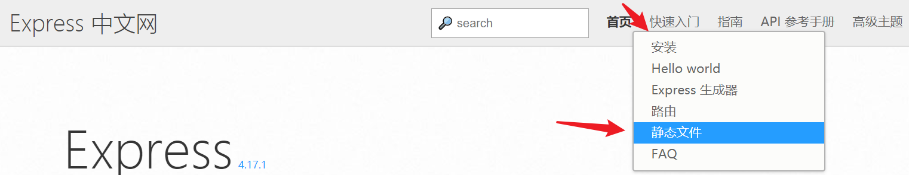
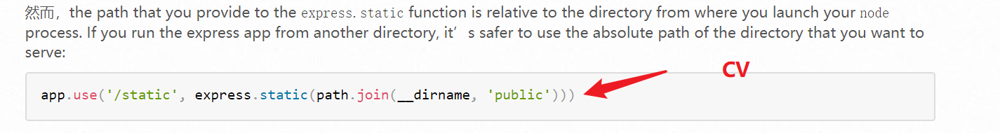
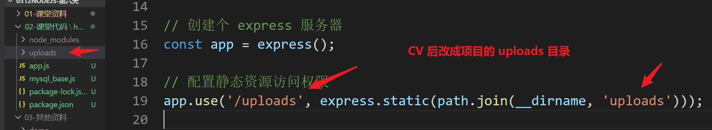
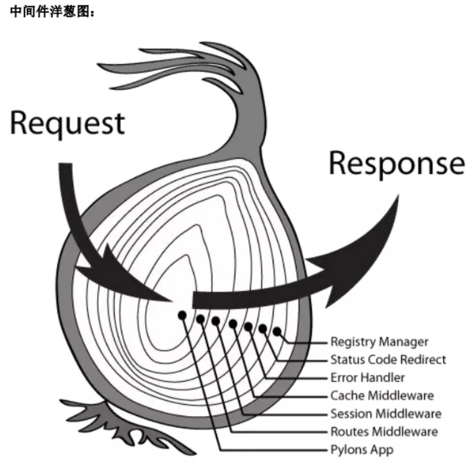

# NodeJS笔记


## express 静态文件配置

前言：服务器所有的静态资源其实对于客户端默认都是不能访问的，静态资源访问其实也是一个请求，需要配置权限。

目的：让客户端能访问到服务器某个文件夹下的所有静态资源。（图片，css 文件，js 文件）

### 如何使用

> Express 中文网： 快速入门 - 静态文件。






### 参考代码



### 注意事项

静态资源配置完毕后，通过 http://127.0.0.1:3000/uploads/xxxx 就可以访问 `uploads` 文件夹下的所有资源。

```js
// 配置静态资源访问权限
// 第一个参数：客户端访问地址       最终客户端路径为：http://127.0.0.1:3000/uploads/xxx
// 第二个参数：服务端文件夹路径
app.use('/uploads', express.static(path.join(__dirname, 'uploads')));
```


## express 中间件

### 概念

就是对 express 所有的请求和响应做中间的一些处理，所以叫中间件。

中间件是整个 express 的核心，核心语法是 app.use() 。

包括我们用到的 app.get()  , app.post() 其实都是基于 app.use() 上封装的。

像我们之前用到的一些第三方中间件，其实就是通过 express 中间件特点对请求和响应做了一些处理。


### 中间件洋葱图

中间件就好比洋葱一样，请求报文一层层处理后，再一层层的处理响应报文。最终返回给客户端。




### 中间应用场景

给所有响应添加 cors。

```js
app.use((request, response, next) => {
    // 给所有的响应报文都添加 Access-Control-Allow-Origin 配置，
    // 所有的请求都可以实现 cors 跨源资源共享
    response.setHeader('Access-Control-Allow-Origin', '*');
    // 代表继续运行下一个中间件
    next();
});
```


## 跨域问题和解决方案

ajax 跨域访问经典报错。


### 浏览器同源安全限制

安全限制 主要是 限制  ajax 的请求，主要限制 3 个地方。


#### 同源概念

三同：

1. 协议相同  (   http     https      file      ftp )
2. 域相同    （  localhost       127.0.0.1     www.baidu.com ）
3. 端口相同   (    80    443     3000  ) 

ajax 访问的时候，如果任意一个不同，都属于 不同源访问，默认受到限制（浏览器报错）。


#### 要实现同源访问（了解即可）

1. 后端人员把所有前端代码都放到服务器上。
2. 后端人员配置静态资源访问权限，才能通过 服务器方式 访问前端代码的文件。
3. 前端开发者要用 同源的方式 访问，需要协议相同，域相同，端口要相同。

结论：麻烦。


#### 是否同源测试题

https://127.0.0.1:3000    和    http://127.0.0.1:3000

不同源：协议不同，第一个协议是  https , 第二个协议是 http。

http://127.0.0.1:3000      和    http://localhost:3000  

不同源：域不同，第一个域是 127.0.0.1，第二个域是 localhost。

易错点：虽然两种写法都能访问本地服务器，但是域不同，就是不同源。

http://127.0.0.1:4399      和    http://localhost:3000     

 不同源：端口不同，第一个端口是 4399，第二个端口是 3000。


### 跨源资源共享 CORS

由于同源限制好多，大家了解即可。工作的时候，后端的接口一般要实现跨域。

跨域访问一定要后端实现了，前端才能访问到。

#### 解决方案

在后端的响应报文中，添加 Access-Control-Allow-Origin :  * 。

Access 访问，Control - 控制，Allow - 允许，Origin - 源。

`*` 代表任意源否允许访问，协议，域 和 端口都不做限制。

#### CORS 实现参考代码

```js
// 通过中间件语法实现
app.use((request, response, next)=>{
    // 设置 CORS 跨源资源共享
    response.setHeader('Access-Control-Allow-Origin', '*');
    // 中间件记得 next()
    next();
});
```


## 服务端代码参考

### 按需导包和中间件配置

```js
// app.js 新建在项目的根目录下，和 package.json 同级
// app.js 一般称为 NodeJS 项目的入口文件。

// 按需导入 mysql 包
const mysql = require('mysql');
// 按需导入 express 包
const express = require('express');
// 按需导入 multer 包，用于处理 formdata 格式参数
const multer = require('multer');
// 按需导入 path 模块，用于处理绝对路径
const path = require('path');
// CV 大法过来的，是 multer 的配置，把相对路径改成绝对路径
const upload = multer({ dest: path.join(__dirname, 'uploads/') });

// 创建个 express 服务器
const app = express();

// 端口监听
app.listen(3000, () => {
    console.log('服务器启动成功提示');
});

// 配置静态资源访问权限
// 客户端访问路径为：http://127.0.0.1:3000/uploads/xxx
// 第一个参数：客户端访问地址
// 第二个参数：服务端文件夹路径
app.use('/uploads', express.static(path.join(__dirname, 'uploads')));

// 如果要实现同源访问，前端代码就要放到服务器上，并配置静态资源访问权限。
// 第一个参数 /：表示用 http://127.0.0.1:3000/ 即可访问到 www 这级目录
app.use('/', express.static(path.join(__dirname, 'www')));

// 通过中间件语法实现
app.use((request, response, next)=>{
    // 设置 CORS 跨源资源共享
    response.setHeader('Access-Control-Allow-Origin', '*');
    // 中间件记得 next()
    next();
});

// 创建 mysql 数据库连接
const connection = mysql.createConnection({
    // 本地数据库地址 (本地服务器固定写法)
    host: 'localhost',
    // 数据库用户名 - 默认用户名是 root
    user: 'root',
    // 数据库密码 - 默认密码是 root
    password: 'root',
    // 数据库名称
    database: 'hm43'
});

// 连接数据库
connection.connect();
```
### 英雄列表
```js
// 创建后端路由接口
// ------------------ 接口书写开始 ------------------
// 接口1：### 英雄列表
// 请求地址：/list
// 请求方式：get
// 请求参数：无
// 返回数据：
// |  id   | number | 英雄id   |
// | name  | string | 英雄姓名 |
// | skill | string | 英雄技能 |
// | icon  | string | 英雄头像 |
app.get('/list', (request, response) => {
    // 1. 准备 mysql 语句，只返回 id,name,skill,icon 即可，条件是 isDelete=0
    const sqlStr = `select id,name,skill,icon from hero where isDelete=0`;
    // 2. 根据 sql 语句操作数据库
    connection.query(sqlStr, (error, results) => {
        // error    错误对象
        // results  结果
        if (error) {
            response.send({
                msg: '获取失败',
                code: 400
            });
        } else {
            // console.log('结果：results', results);
            // 最终返回的是 isDelete=0 的数据，因为 isDelete=1 是标记删除的，所以不返回
            response.send({
                msg: '获取成功',
                code: 200,
                // results 返回的结果，就是对象的格式，直接作为 data 的值
                data: results
            });
        }
    });
});
```
### 英雄删除
```js
// 接口2：### 英雄删除
// 注意事项：这里其实不是真正把数据在数据库删掉了，而是把 isDelete 的标记改成 1 而已。
// 请求地址：/delete
// 请求方式：get
// 请求参数：
// |  id  | number | 英雄id |
app.get('/delete', (request, response) => {
    // 1. request.query 获取 get 请求中的 id 参数的值
    const { id } = request.query;
    // 2. 准备 mysql 语句，根据id查询一条数据
    const sqlStr = `update hero set isDelete=1 where id=${id}`;
    // 3. 根据 sql 语句操作数据库
    connection.query(sqlStr, (error, results) => {
        // error    错误对象
        // results  结果
        if (error) {
            response.send({
                msg: "缺少id参数",
                code: 400
            });
        } else {
            // 如果标记修改成功，就会有一行数据受到影响
            // results.changedRows 为影响行，固定写法，打印到控制台能看到
            if (results.changedRows === 1) {
                response.send({
                    msg: "删除成功",
                    code: 204
                });
            } else {
                response.send({
                    msg: "参数错误",
                    code: 400
                });
            }
        }
    });
});
```
### 英雄查询-根据id查单个英雄
```js
// 接口3：### 英雄查询-根据id查单个英雄
// 请求地址：/search
// 请求方式：get
// 请求参数：
// |  id  | number | 英雄id |
app.get('/search', (request, response) => {
    // 1. request.query 解构获取 get 请求中的 id 参数的值
    const { id } = request.query;
    // 2. 准备 sql 语句
    const sqlStr = `select id,name,skill,icon from hero where id=${id} and isDelete=0`;
    // 3. 执行数据库操作
    connection.query(sqlStr, (error, results) => {
        // error    错误对象
        // results  结果
        if (error) {
            response.send({
                code: 400,
                msg: '缺少id参数'
            });
        } else {
            console.log(results);
            // 查询的结果是数组格式，把数据结构出第一份数据数据
            // 如果解构成功, 就会有值，走 if 逻辑 
            // 如果解构失败, 就是 undefined，走 else 逻辑
            const [data] = results;
            // data 对象如果存在
            if (data) {
                // 返回数据结构按文档来，查询单条数据的时候返回对象
                response.send({
                    msg: '查询成功',
                    code: 200,
                    data
                });
            } else {
                // undefined 就提示参数错误
                response.send({
                    msg: '参数错误',
                    code: 400,
                });
            }
        }
    });
    // 4. 根据数据库运行结果返回数据
});
```
### 英雄新增
```js
// 接口4：### 英雄新增
// 请求地址：/add
// 请求方式：post
// 请求参数：请使用formData的方式提交
// | name  | string | 英雄姓名 |
// | skill | string | 英雄技能 |
// | icon  |  file  | 英雄头像 |
app.post('/add', upload.single('icon'), (request, response) => {
    // request.body 将具有文本域数据，如果存在的话
    const { name, skill } = request.body;
    // request.file 是 `icon` 文件的信息
    // console.log( request.file );
    // 结构出保存后的文件名
    const { filename } = request.file;
    // 把文件名拼接成路径，赋值给 icon
    const icon = `http://127.0.0.1:3000/uploads/${filename}`;
    // 准备 sql 新增数据的语句
    // 坑点：sql 语句最终是运行在 mysql 中的，字符串数据写入的时候，值还需要外面多一对 引号。
    const sqlStr = `insert into hero(name,skill,icon) values ('${name}','${skill}','${icon}')`;
    // 操作数据库
    connection.query(sqlStr, (error, results) => {
        // error    错误对象
        // results  结果
        if (error) {
            response.send({
                code: 400,
                msg: '新增错误'
            });
        } else {
            response.send({
                code: 201,
                msg: '新增成功'
            });
        }
    });
});
```
### 英雄编辑
```js
// 接口5：### 英雄编辑
// 请求地址：/edit
// 请求方式：post
// 请求参数：请使用formData的方式提交
// |  id   | number | 英雄id   |
// | name  | string | 英雄姓名 |
// | skill | string | 英雄技能 |
// | icon  | file | 英雄头像 |
app.post('/edit', upload.single('icon'), (request, response) => {
    // 1. 数据准备
    // request.body 中解构出 id,name,skill 的值.
    const { id, name, skill } = request.body;
    // request.file 结构出 filename 文件名.
    const { filename } = request.file;
    // 把文件名拼接成路径，赋值给 icon
    const icon = `http://127.0.0.1:3000/uploads/${filename}`;
    // 2. 准备 sql 更新语句
    // 这里也有坑点，${name} 需要写成 '${name}'
    const sqlStr = `update hero set name='${name}',skill='${skill}',icon='${icon}' where id=${id} and isDelete=0`;
    // 3. 操作数据库
    connection.query(sqlStr, (error, results) => {
        // error    错误对象
        // results  结果
        if (error) {
            response.send({
                code: 400,
                msg: '错误'
            });
        } else {
            // 一般是修改的时候才需要判断影响行
            if (results.changedRows === 1) {
                response.send({
                    code: 200,
                    msg: '修改成功'
                });
            } else {
                response.send({
                    code: 400,
                    msg: '参数错误'
                });
            }
        }
    });
});
```


## 前端代码参考

### http.js  封装参考

路径为 js/http.js

知识点：

- 沙箱函数

- 形参实参

```js
(function(w){
    // 请求基地址
    const baseURL = 'http://127.0.0.1:3000';

    // 把所有请求用一个对象管理
    const urls = {
        list: `${baseURL}/list`,
        add: `${baseURL}/add`,
        delete: `${baseURL}/delete`,
        search: `${baseURL}/search`,
        edit: `${baseURL}/edit`,
    };

    // 把局部的 urls 添加到全局 window 上
    w.urls = urls;

})(window)
```

### index.html 代码参考

#### 列表渲染

知识点：

- $.ajax()
- 模板引擎

```html
<!-- 1. 导入模板引擎文件 -->
<script src="./lib/js/template-web.js"></script>
<!-- 2. 准备模板，注意添加 id 和 type 属性 -->
<script id="heroList" type="text/html">
  {{ each data }}
  <tr>
    <td></td>
    <td>{{ $value.name }}</td>
    <td>{{ $value.skill }}</td>
    <td>
      <a href="./edit.html?id={{ $value.id }}" class="btn btn-primary btn-edit">编辑</a>
      <a data-id="{{ $value.id }}" class="btn btn-danger btn-delete">删除</a>
    </td>
  </tr>
  {{ /each }}
</script>
<!-- 引入封装好的 http.js -->
<script src="./js/http.js"></script>
<script>
  $(function () {

    // 目标1：展示英雄列表
    // ### 英雄列表
    // 请求地址：/list
    // 请求方式：get
    // 请求参数：无
    // 1. 通过 ajax 发送请求

    // 把获取数据和渲染列表的业务封装起来
    //    1. 页面初次打开需要调用
    //    2. 删除成功之后需要调用
    const renderList = () => {
      $.ajax({
        type: "get",
        url: urls.list,
        dataType: "json",
        success: function (response) {
          // 从 response 解构出来 code
          const { code } = response;
          if (code === 200) {
            // 2. 通过模板引擎实现列表渲染
            // console.log(response);
            // 4. 调用模板
            const htmlStr = template('heroList', response);
            // 5. 渲染到页面
            $('#my-table tbody').html(htmlStr);
          }
        }
      });
    }
    // 1. 页面初次打开需要调用
    renderList();
  });
</script>
```

#### 删除英雄

知识点：

- 事件委托
- 自定义属性获取

```js
    // 2. 删除英雄
    // ### 英雄删除
    // 请求地址：/delete
    // 请求方式：get
    // 请求参数: id

    // 删除按钮是动态生成的，所以绑定事件的时候需要用 事件委托 实现
    // 把事件委托给 #my-table，通过删除按钮触发事件
    $('#my-table').on('click', '.btn-delete', function () {
      // 获取点击的删除按钮的 id 值
      const id = $(this).attr('data-id');
      // ajax 调用接口，实现数据的删除。
      // 删除成功后，记得重新渲染页面。
      $.ajax({
        type: "get",
        url: urls.delete,
        data: {
          // 对象字面量简写，如果对象的 键名称 和 变量(常量) 同名，可以省略一个 
          id
          // 等价于以下代码
          // id:id
        },
        dataType: "json",
        success({ msg, code }) {
          console.log(msg, code);
          if (code === 204) {
            // alert('成功,重新请求列表数据');
            // 2. 删除成功之后需要调用列表渲染
            renderList();
          } else {
            alert('操作失败');
          }
        }
      });
    });
```


### add.html 代码参考

#### 新增英雄

知识点：

- FormData 对象创建和添加数据
- FormData 对象和 ajax 上传
- .trim()    去除首尾空格
- file         文件对象获取

```html
<!-- 引入封装好的 http.js -->
<script src="./js/http.js"></script>
<script>

  $(function () {

    // 目标2：实现英雄新增功能
    // 当点击按钮的时候
    //   1. 获取英雄名字，英雄技能，英雄图片
    //   2. ajax 请求把数据发送给服务端实现新增功能
    $('.btn-add').click(function (e) {
      // 阻止表单默认行为
      e.preventDefault();
      //   1. 获取英雄名字，英雄技能，英雄图片
      const name = $('#heroName').val().trim();
      const skill = $('#skillName').val().trim();

      // 这里是先找到上传按钮，第一个 [0] 转成原生对象，第二个 [0]，从文件对象中取出上传的一张图片
      // 必须转成原生对象才能获取到 file 对象
      const icon = $('#heroIcon')[0].files[0];

      if (name === '' && skill === '') {
        alert('请输入英雄名和技能名称');
      } else if (!icon) {
        alert('请上传英雄图片');
      } else {
        // formdata 解决方案1：
        // 涉及到图片的上传，我们使用 fd 对象
        const fd = new FormData();
        // 往 fd 对象中添加参数
        fd.append('name', name);
        fd.append('skill', skill);
        fd.append('icon', icon);

        // formdata 解决方案2：
        // 把当前点击按钮的表单，作为 FormDate 的参数
        // 这种写法需要在 html 结构中把 name 属性的值改成 后端参数的名称
        // const fd = new FormData(this.form);

        // ajax post 请求实现英雄新增
        $.ajax({
          type: "post",
          url: urls.add,
          // 要实现图片上传，我们需要上传 formdata 对象
          data: fd,
          // fd 上传不要jq帮忙添加请求头
          contentType: false,
          // fd 上传不要jq帮忙把参数转成字符串
          processData: false,
          dataType: "json",
          // 结构赋值可以直接写在形参位置，直接解构
          success({ code, msg }) {
            // console.log(response);
            console.log(code, msg);
            // 从 response 对象中解构出 code 和 msg
            // const { code, msg } = response;
            // 新增成功的提示是 201
            if (code === 201) {
              alert('新增成功');
              // 新增成功跳转回首页
              location.href = './index.html';
            } else {
              alert('新增失败');
            }
          }
        });
      }
    });
  })

</script>
```

#### 图片本地预览

```js
	// 目标3：图片预览功能
    //   3.1.点击 图片 和 点击上传按钮都可以实现图片选择, 在 HTML 结构中通过 label 标签实现即可
    $('#heroIcon').change(function (e) {
      // 获取自身的 file 对象
      const file = this.files[0];
      // 获取 file 对象的浏览器缓存中的路径
      const url = URL.createObjectURL(file);
      // 把预览图片的 src 地址改成 浏览器的缓存路径实现预览
      $('.preview').attr('src', url);

    });
```

#### 取消按钮

```js
// 点击取消按钮回到首页
$('.btn-cancel').click(function(e){
    location.href = './index.html';
});
```


### edit.html 代码参考

#### 页面参数获取

知识点：

- location.search 获取页面参数
- .split('=')      把字符串分隔成数组
- Number()    数据类型转换
- location.href   页面跳转  

```html
<!-- 引入封装好的 http.js -->
<script src="./js/http.js"></script>
<script>
  $(function () {
    // 1. 从地址栏中把 ?id=xxx 的 id 值找出来
    // console.log(location);

    // location.search 记录了链接中的参数，也就是获取到 ?参数1=值1 这部分数据。
    // 数组的结构赋值需要按循序获取
    let [, id] = location.search.split('=');
    // 结构赋值等价于以下这行代码
    // const id = location.search.split('=')[1];
    // 把 id 转成数值型，用于判断数据类型
    id = Number(id);
    console.log('页面的id参数', id);
    // 如果 id 是 NaN 获取 id 的值是 0
    if (!id) {
      // 提示用户
      alert('请用正确方式打开页面');
      // 跳转会首页，编辑页需要通过首页点击编辑才进入
      location.href = './index.html';
    }
  })
</script>
```

#### 英雄查询

```js

    // 目标：### 英雄查询
    // 请求地址：/search
    // 请求方式：get
    // 请求参数：
    // |  id  | number | 英雄id |

    $.ajax({
      type: "get",
      url: urls.search,
      data: {
        id
        // 等价于
        // id: id
      },
      dataType: "json",
      success: function ({ msg, code, data }) {
        console.log(msg, code, data);
        // 查询成功是 200
        if (code === 200) {
          // data 中的数据显示到表单中
          const { id, name, skill, icon } = data;
          // 把 name 和 skill 添加到输入框中
          $('#heroName').val(name);
          $('#skillName').val(skill);
          // 把图片链接添加到 img 的 src 中
          $('.preview').attr('src', icon);
          // 给保存按钮也添加个 data-id
          $('.btn-save').attr('data-id', id);
        } else {
          alert('操作错误');
        }

      }
    });
```

#### 英雄编辑

知识点：

- files           文件获取
- FormData 对象

```js
	// 目标：### 英雄编辑
    // 请求地址：/edit
    // 请求方式：post
    // 请求参数：请使用formData的方式提交
    // |  id   | number | 英雄id   |
    // | name  | string | 英雄姓名 |
    // | skill | string | 英雄技能 |
    // | icon  | string | 英雄头像 |

    // 给保存按钮添加点击事件
    $('.btn-save').click(function (e) {
      e.preventDefault();
      //  1. 获取输入框的值和图片对象
      const name = $('#heroName').val();
      const skill = $('#skillName').val();
      // 注意这里的写法，需要转换成原生方式获取到对象
      const icon = $('#heroIcon')[0].files[0];
      // const id = $(this).attr('data-id');
      //  2. 参数需要以 formdata 格式提交，需要按照文档把四个参数都添加到 fd 对象中

      // 准备一个 fd 对象
      const fd = new FormData();
      // 给 fd 对象添加四个参数
      fd.append('name', name);
      fd.append('skill', skill);
      fd.append('icon', icon);
      fd.append('id', id);
      //  3. ajax 请求实现修改

      $.ajax({
        type: 'post',
        url: urls.edit,
        // fd 对象就是参数
        data: fd,
        // 无需自动添加请求头
        contentType: false,
        // 无需转换成字符串
        processData: false,
        dataType: "json",
        success({ msg, code }) {
          // console.log(msg, code);
          if (code === 200) {
            alert(msg);
            // 修改成功回到首页
            location.href = './index.html';
          } else {
            alert(msg);
          }
        }
      });

    });
```

#### 其他

edit.html 的图片预览功能参考 add.html 页面的做法。

还有取消按钮，输入框的值非空判断处理等。

