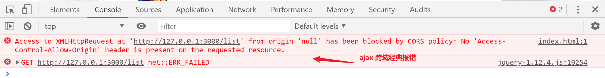

## express 静态文件配置

前言：服务器所有的静态资源其实对于客户端默认都是不能访问的，静态资源访问其实也是一个请求，需要配置权限。

目的：让客户端能访问到服务器某个文件夹下的所有静态资源。（图片，css 文件，js 文件）

> Express 中文网： 快速入门 - 静态文件。


静态资源配置完毕后，就可以访问 uploads 文件夹下的所有资源。


## express 中间件

概念： 就是对 express 所有的请求和响应做中间的一些处理。

中间件是整个 express 的核心，核心语法是 app.use() 。

包括我们用到的 app.get()  , app.post() 其实都是基于 app.use() 上封装的。

像我们之前用到的一些第三方中间件，其实就是通过 express 中间件特点对请求和响应做了一些处理。


### 中间应用场景

给所有响应添加 cors。

```js
app.use((request, response, next) => {
    // 给所有的响应报文都添加 Access-Control-Allow-Origin 配置，
    // 所有的请求都可以实现 cors 跨源资源共享
    response.setHeader('Access-Control-Allow-Origin', '*');
    // 代表继续运行下一个中间件
    next();
});
```


## 跨域问题和解决方案

ajax 跨域访问经典报错。




### 浏览器同源安全限制

安全限制 主要是 限制  ajax 的请求，主要限制 3 个地方。


#### 同源概念

三同：

1. 协议相同  (   http     https      file      ftp )
2. 域相同    （  localhost       127.0.0.1     www.baidu.com ）
3. 端口相同   (    80    443     3000  ) 

ajax 访问的时候，如果任意一个不同，都属于 不同源访问，默认受到限制（浏览器报错）。


#### 要实现同源访问（了解即可）

1. 后端人员把所有前端代码都放到服务器上。
2. 后端人员配置静态资源访问权限，才能通过 服务器方式 访问前端代码的文件。
3. 前端开发者要用 同源的方式 访问，需要协议相同，域相同，端口要相同。

结论：麻烦。


#### 是否同源测试题

https://127.0.0.1:3000    和    http://127.0.0.1:3000

不同源：协议不同，第一个协议是  https , 第二个协议是 http。

http://127.0.0.1:3000      和    http://localhost:3000  

不同源：域不同，第一个域是 127.0.0.1，第二个域是 localhost。

易错点：虽然两种写法都能访问本地服务器，但是域不同，就是不同源。

http://127.0.0.1:4399      和    http://localhost:3000     

 不同源：端口不同，第一个端口是 4399，第二个端口是 3000。


### 跨源资源共享 CORS

由于同源限制好多，大家了解即可。工作的时候，后端的接口一般要实现跨域。

跨域访问一定要后端实现了，前端才能访问到。

解决方案：

在后端的响应报文中，添加 Access-Control-Allow-Origin :  * 。

Access 访问，Control - 控制，Allow - 允许，Origin - 源。

`*` 代表任意源否允许访问，协议，域 和 端口都不做限制。


